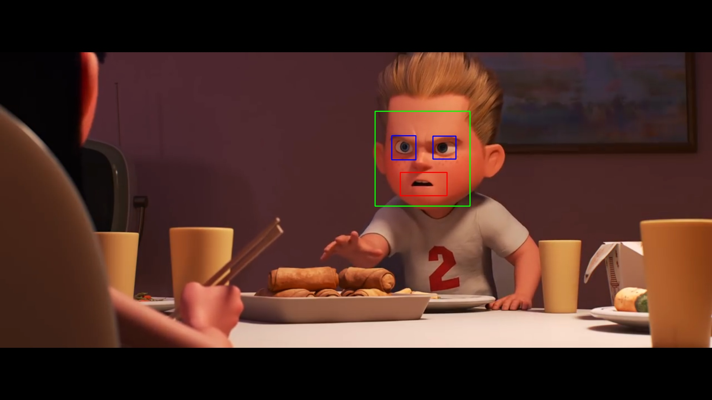

# **Face, Eyes and Smile Detection**
---
Simple **OpenCV** code for detection of face, eyes and smile/mouth using **_Haar Cascades_**.
The code is designed for still images but with simple tweaks in code, it can be used to detect face, eyes and smile in videos and live streams.   
With minor changes, this code can also be used for **motion detection** in videos and live streams.

---
### **Original Image**
---

---

### **Processed Image**
---

---